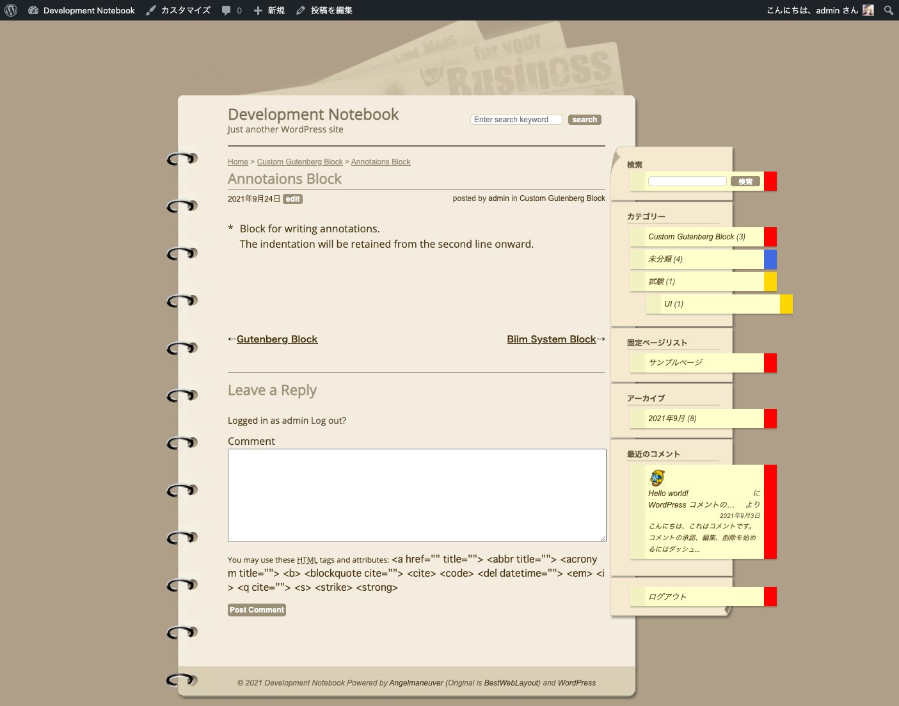
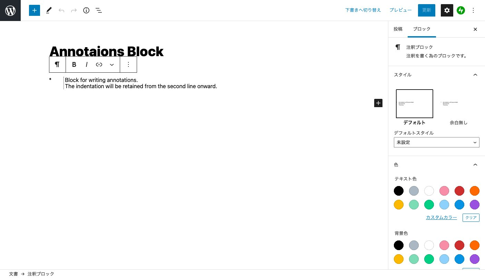
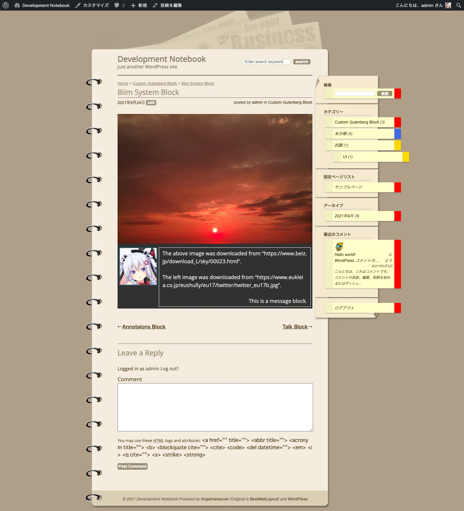
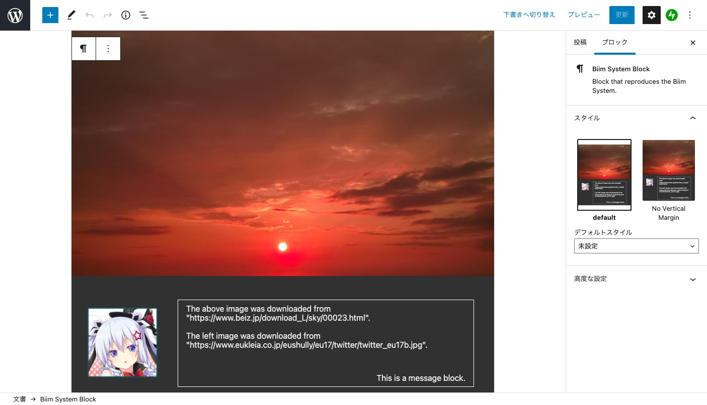
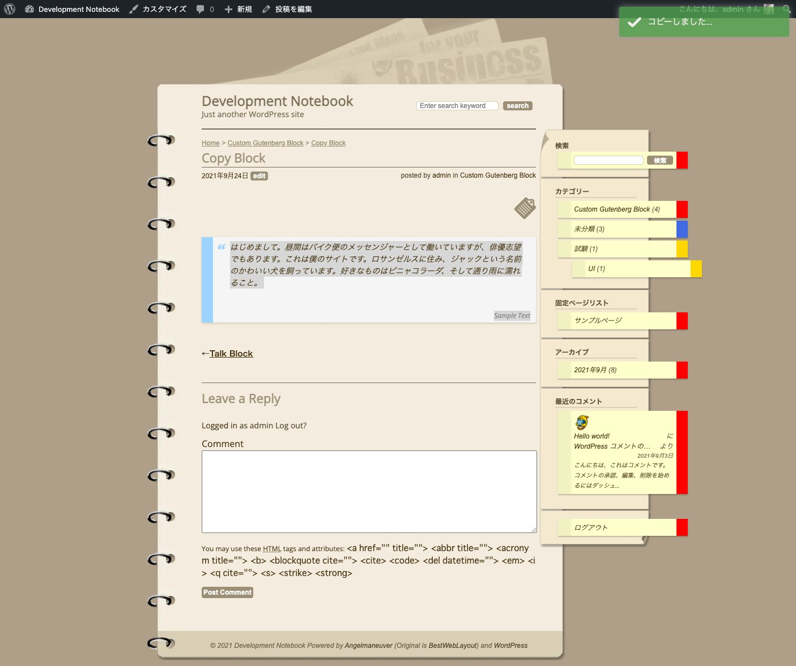
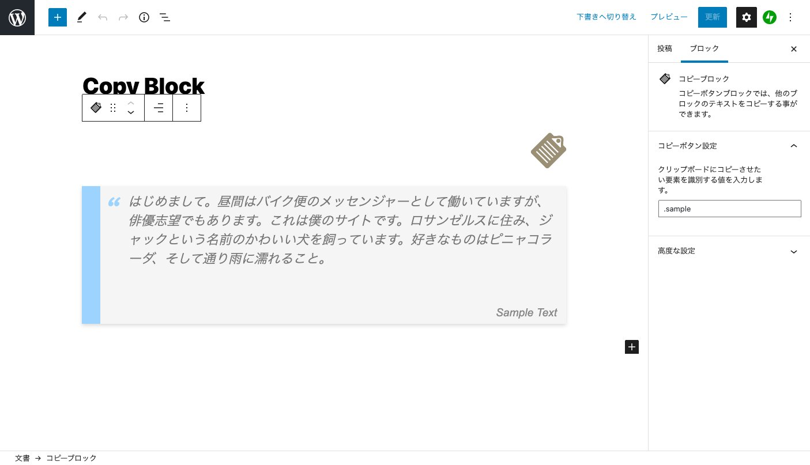
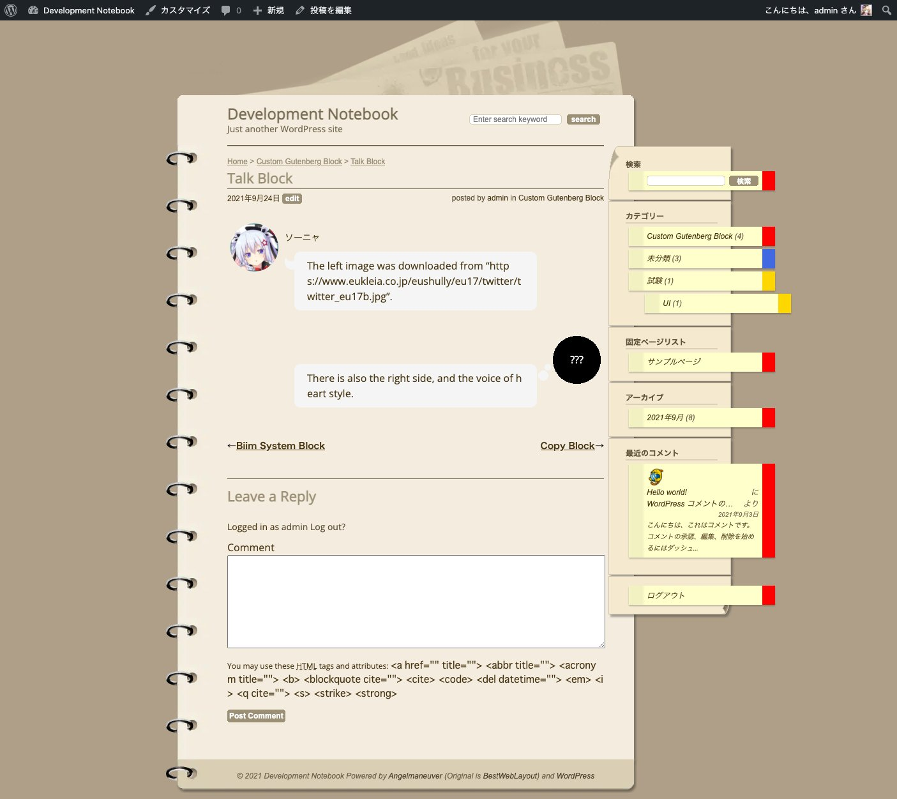
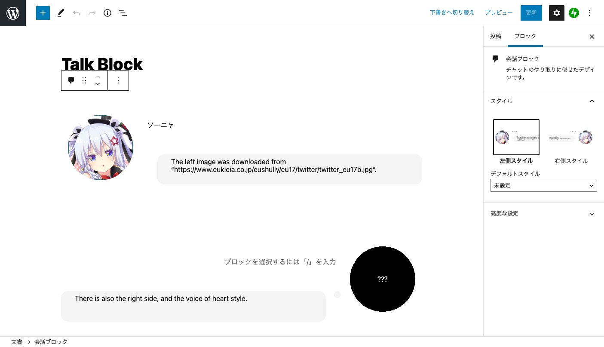
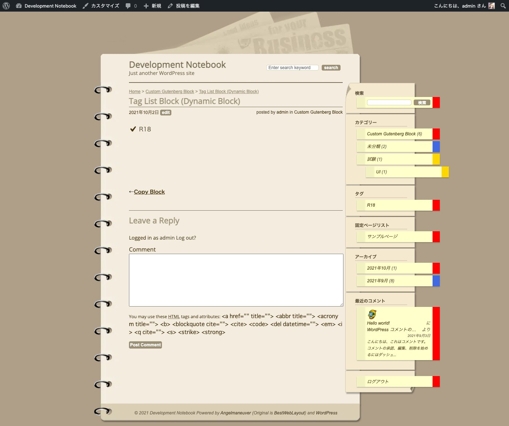
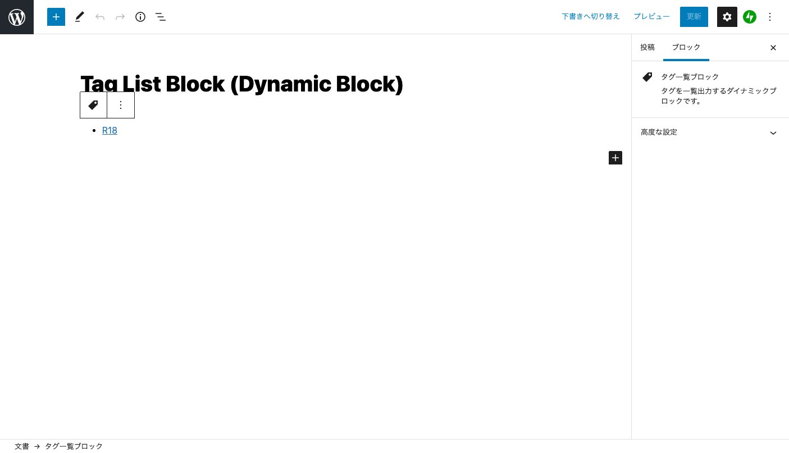

# Sketchpad modified - Blocks

 

Custom Gutenberg Blocks for myself.

## Annotations Block
Block for writing annotations.

### Public Style

### Editor Style

## Biim System Block
Block that reproduces the Biim System.

\* In japan, The "biim system" is the most popular screen layout for live game video.

### Public Style

### Editor Style

## Copy Block
Copy button block allows you to copy the text of other blocks.

### Public Style

### Editor Style

## Talk Block
Designed to look like a chat exchange.

### Public Style

### Editor Style

## Tag List Block (Dynamic Block)
A dynamic block that outputs a list of tags.

### Public Style

### Editor Style

